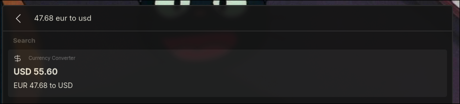
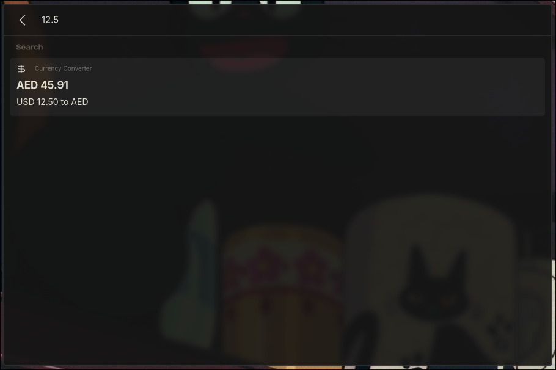

# Sherlock-currency

Sherlock currency is a simple script to allows you convert between different currencies.

<div align="center" style="text-align:center;">
  <picture>
    
  </picture>
  <picture>
    
  </picture>
</div>

## Table of Contents

- [Getting Started](#getting-started)
  - [Dependencies](#dependencies)
  - [Installation](#installation)
    - [Using the Binary](#using-the-binary)
    - [From Source](#from-source)

## Getting Started

### 1. Dependencies

To run `sherlock-currency`, ensure the following dependencies are installed:

- `Sherlock Application Launcher` - [Getting Started with Sherlock](https://github.com/Skxxtz/sherlock#getting-started)

Additionally, if you're building from source, you will need:

- `rust` - [How to install rust](https://www.rust-lang.org/tools/install)

An active internet connection when running it for the first time.
<br><br>

### 2. Istallation

#### <ins>From Source</ins>

To build `Sherlock-currency` from source, follow these steps.<br>
Make sure you have the necessary dependencies installed:

- `rust` - [How to install rust](https://www.rust-lang.org/tools/install)
- `git` - [How to install git](https://github.com/git-guides/install-git)

1. Clone the repository:

```bash
git clone https://github.com/zoclhas/Sherlock-currency.git
cd sherlock-currency
```

2. Install necessary Rust dependencies and build the app:

```bash
cargo build --release
```

3. Install the binary:

```bash
mkdir -p ~/.config/sherlock/scripts/
cp target/release/sherlock-currency ~/.config/sherlock/scripts/
```

### Post Installation

You can now refer to `sherlock-currecny` in your `fallback.json` file like so:

```
  {
    "name": "Currency Converter",
    "alias": "cr",
    "type": "bulk_text",
    "async": true,
    "on_return": "copy",
    "args": {
      "icon": "money",
      "exec": "~/.config/sherlock/scripts/sherlock-currency",
      "exec-args": "{keyword}"
    },
    "priority": 0,
    "shortcut": false
  }
```

> 💡 **NOTE:** to use an icon that's not included in your standard icon theme you must set a custom icon path within your `config.toml` file. See [Example Config](https://github.com/Skxxtz/sherlock/blob/main/docs/examples/config.toml)
